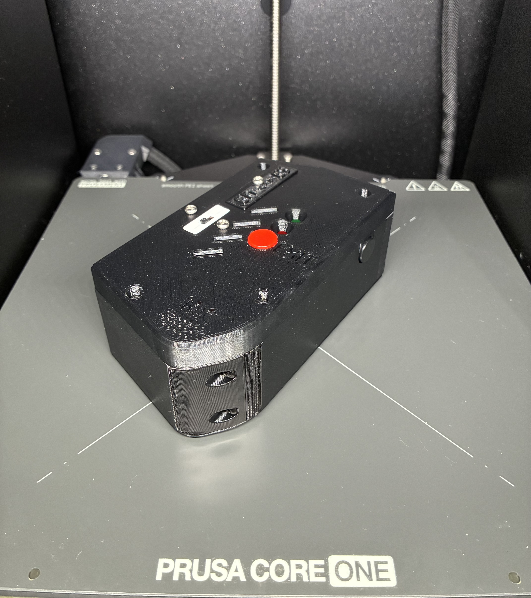

# EchoLingo

A completely **offline** translator running on a Raspberry Pi 5 using <ins>VOSK, Piper, and CTranslate2<ins>

# Case Components
***1x*** <ins> Echolingo V3 - Bottom.STEP<ins>

***1x*** <ins> Echolingo V3 - Cover V1.STEP<ins>

***1x*** <ins> Echolingo V3 - Pisugar Side Panel V5.STEP<ins>

***1x*** <ins> Echolingo V3 - Amp Panel V5.STEP<ins>

***1x*** <ins> Echolingo V3 - Mic Panel V2.STEP<ins>

***1x*** <ins> Echolingo V3 - Button Securer.STEP<ins>

***2x*** <ins> Echolingo V3 - button.STEP<ins>

***2x*** <ins> Echolingo V3 - Switch Mount Half.STEP<ins>

# Electrical Components
***1x*** <ins> Raspberry Pi 5<ins>

***1x*** <ins> Custom PCB (Working on PCB design in KiCAD)<ins>

***1x*** <ins> [3W 4Ohm Speaker](https://www.amazon.com/Dweii-Loundspeaker-JST-PH2-0mm-2-Electronic-Advertising/dp/B0BTP67F81?th=1)<ins>

***1x*** <ins> [Small USB Microphone](https://www.adafruit.com/product/3367)<ins>

***1x*** <ins> [PiSugar 3 Plus](https://www.amazon.com/PiSugar-Plus-Pwnagotchi-Management-Raspberry/dp/B0FBK89B8H)<ins>

***1x*** <ins> [MAX98357A Amp](https://www.adafruit.com/product/3006)<ins>

# Screws

***6x*** <ins> M3x10 Button Head Screw<ins>

***4x*** <ins> M3x8 Countersunk Head Screw<ins>

***5x*** <ins> M3x6 Countersunk Head Screw<ins>

***2x*** <ins> M3x8 Button Head Screw<ins>

***3x*** <ins> M3x6 Button Head Screw<ins>
